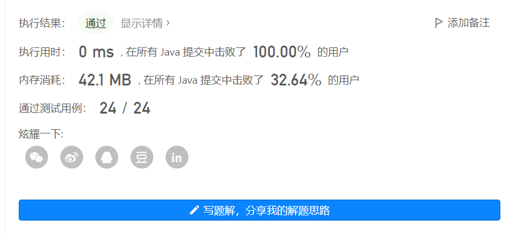

#### [剑指 Offer 06. 从尾到头打印链表](https://leetcode.cn/problems/cong-wei-dao-tou-da-yin-lian-biao-lcof/)

输入一个链表的头节点，从尾到头反过来返回每个节点的值（用数组返回）。

 **示例 1：**

```
输入：head = [1,3,2]
输出：[2,3,1]
```

**限制：**

```
0 <= 链表长度 <= 10000
```


> 解法一：
>
> ​	使用最简单的思路，将链表元素遍历出来，使用额外list集合存储，然后再添加到数组中。

```java
	public int[] reversePrint(ListNode head) {
        ListNode temp = head;
        List<Integer> list = new ArrayList<>();
        while(temp != null) {
            list.add(0, temp.val);
            temp = temp.next;
        }
        int[] res = new int[list.size()];
        for(int i = 0; i < list.size(); i++){
            res[i] = list.get(i);
        }
        return res;
    }
```


> 解法二：
>
> ​	思路同解法一，但是不使用额外空间存储元素，直接计数，遍历两遍链表

```java
	public int[] reversePrint(ListNode head) {
        ListNode temp = head;
        int count = 0;
        while(temp != null) {
            count++;
            temp = temp.next;
        }
        int[] res = new int[count];
        temp = head;
        for(int i = count - 1; i >= 0; i--) {
            res[i] = temp.val;
            temp = temp.next;
        }
        return res;
    }
```

