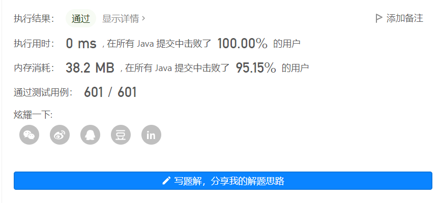
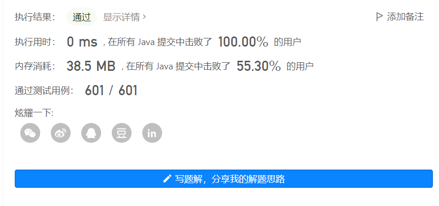
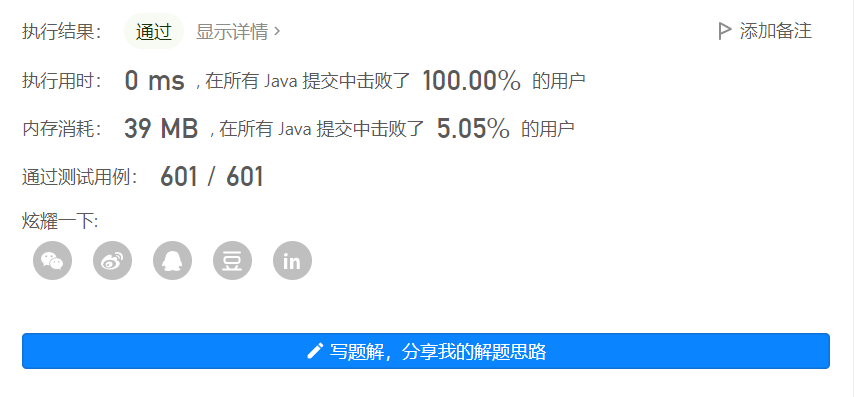

#### [剑指 Offer 15. 二进制中1的个数](https://leetcode.cn/problems/er-jin-zhi-zhong-1de-ge-shu-lcof/)

编写一个函数，输入是一个无符号整数（以二进制串的形式），返回其二进制表达式中数字位数为 '1' 的个数（也被称为 汉明重量).）。

 

提示：

* 请注意，在某些语言（如 Java）中，没有无符号整数类型。在这种情况下，输入和输出都将被指定为有符号整数类型，并且不应影响您的实现，因为无论整数是有符号的还是无符号的，其内部的二进制表示形式都是相同的。
* 在 Java 中，编译器使用 二进制补码 记法来表示有符号整数。因此，在上面的 示例 3 中，输入表示有符号整数 -3。


示例 1：

```
输入：n = 11 (控制台输入 00000000000000000000000000001011)
输出：3
解释：输入的二进制串 00000000000000000000000000001011 中，共有三位为 '1'。
```


示例 2：

```
输入：n = 128 (控制台输入 00000000000000000000000010000000)
输出：1
解释：输入的二进制串 00000000000000000000000010000000 中，共有一位为 '1'。
```


示例 3：

```
输入：n = 4294967293 (控制台输入 11111111111111111111111111111101，部分语言中 n = -3）
输出：31
解释：输入的二进制串 11111111111111111111111111111101 中，共有 31 位为 '1'。
```

来源：力扣（LeetCode）
链接：https://leetcode.cn/problems/er-jin-zhi-zhong-1de-ge-shu-lcof
著作权归领扣网络所有。商业转载请联系官方授权，非商业转载请注明出处。


> 解法一：让要计算的数字与该数减一 进行与运算
>
> 例如  让7（111）&6（110）得到的是6（110），接着6（110）&5（101）得到4（100），接着4（100）&3（011）得到0（000），程序结束，    得到的结果就是有3个“1”。

```java
	public int hammingWeight(int n) {
        int sum = 0;
        while(n != 0) {
            sum ++;
            n = n & (n - 1);
        }
        return sum;
    }
```



> 解法二：Java自带API ==> Integer.bitCount

```java
	public int hammingWeight(int n) {
        return Integer.bitCount(n);
    }
```

API源码解析：

```java
    public static int bitCount(int i) {
        i = i - ((i >>> 1) & 0x55555555);
        i = (i & 0x33333333) + ((i >>> 2) & 0x33333333);
        i = (i + (i >>> 4)) & 0x0f0f0f0f;
        i = i + (i >>> 8);
        i = i + (i >>> 16);
        return i & 0x3f;
    }
```

一篇很好的博客分享解析过程 ：[ Java Integer.bitCount()方法解析_Yohohaha的博客-CSDN博客_integer.bitcount](https://blog.csdn.net/Yohohaha/article/details/72744434)



> 解法三：普通位运算
>
> ​	让1循环32次，分别与n进行&运算，如果不为0，次数就加一，最后的结果就是1的个数

```java
	public int hammingWeight(int n) {
        int res = 0;
        for(int i = 0; i < 32; i++) {
            if((n & (1 << i)) != 0 ) {
                res ++;
            }
        }
        return res;
    }	
```

